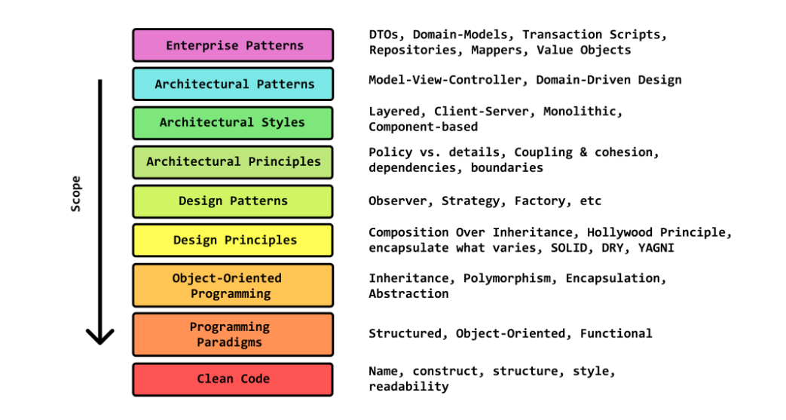

### Folders structure
* [Folders structure](https://softwareengineering.stackexchange.com/questions/338597/folder-by-type-or-folder-by-feature)
* Good approach is mixed: folders by feature => folder by type OR folders by type => folder by feature
    * With single class in package root (as package interface), everything else should be hidden in folders (as implementation details)
    
### Root folders structure
* Root folders structure №1:
    * `common` (e.g. DateUtils)
    * `rest`
    * `service`
    * `db`
* Root folders structure №2:
    * `inbound`
        * `rest`
        * `soap`
    * `outbound`
        * `db`
        * `mq`
        * `rest`
    * `service`
    * `common`
    
### Sub folders structure
* Sub folders structure №1:
    * `Diagnosis`
        * `Converter` (package)
        * `Dto` (package)
        * `Service` (package)
        * `Validator` (package)
        * `DiagnosisRepository` (class, as package interface)
* Sub folders structure №2:
    * `Dto`
        * `Diagnosis` (package)
        * `Call` (package)
    * `Service`
        * `Diagnosis` (package)
        * `Call` (package)
    * `Repository`
        * `Diagnosis` (package)
        * `Call` (package)
* Package interface examples - @RestController, @Service, @Repository   
 
## API
`API` - defines interfaces through which interactions happen (REST/SOAP)
* Trick to write good API:
    * Think of yourself as of API consumer, what should perfect API look like?
    * Write some client-side code for not existing API to have a better understanding

## Architecture levels

